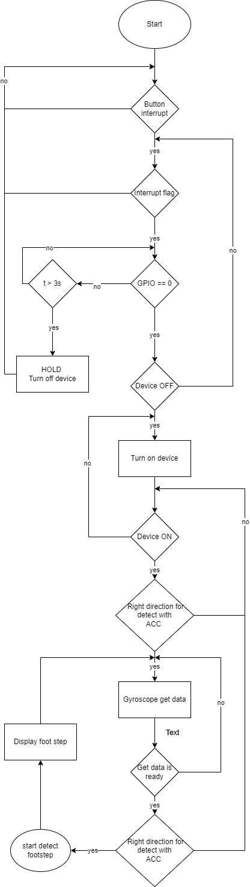
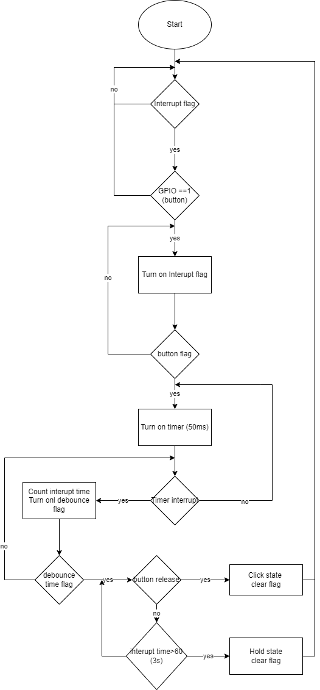
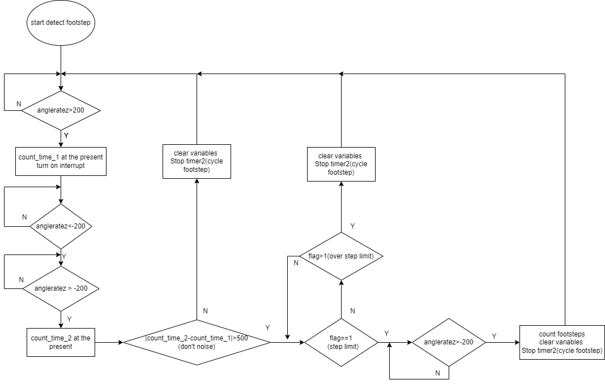

# PROJECT

## TITLE 

  **FOOTSTEP DETECTION**

## Describe 

  + The project uses acceleration sensor to detect 3 axis direction of the device for allowing when to be determined footstep.
  + The gyroscope sensor is applied for detecting hand movement when working by using angular velocity of three device axis.
  + Angular velocity of Z-axis indicates the velocity of hand movement. If the z-axis value crosses a specific threshold and the period of a hand gesture above 500ms is less than 1s, then define 1 reverse move as noise and ignore it.  
  + Orientation of the device for measurement when tilting the device to the right.

## Method

  ### General system flowchart

  ]

  ### Button flowchart

  ]

  ### Footstep detection flowchart

  ]
    

## Driver

  + Button DRIVER
  + OLED DRIVER (SSD1306)
  + L3GD20 DRIVER (Gyroscope sensor)
  + LSM303DLHC DRIVER (Accelaration sensor)
  
## Author
#@author Nam Nguyen
#@author Long Huynh
